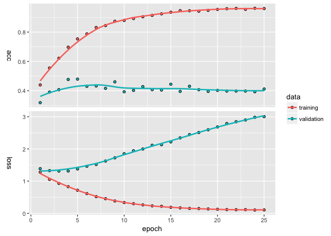

kerasformula
================
Pete Mohanty
May 3, 2018

[](https://cran.r-project.org/package=kerasformula)

kerasformula
============

Now on CRAN, `kerasformula` offers a high-level interface to [keras](https://github.com/rdrr1990/keras) neural nets that takes advantage of `R` formulas.

`kms` is the main function of `library(kerasformula)`, a high-level interface for [Keras for R](https://keras.rstudio.com/). `kms`, as in `keras_model_sequential()`, is a regression-style function that lets you build `keras` neural nets with `R` `formula` objects. Formulas are very powerful in R; in the first example below, a small tweak in the way the dependent variable is coded explains an additional 20% of out of sample variance. `kms` splits training and test data into sparse matrices.`kms` also auto-detects whether the dependent variable is categorical or binary.

`kms` accepts the major parameters found in `library(keras)` as inputs (loss function, batch size, number of epochs, etc.) and allows users to customize basic neural nets which, by default, now include regularizers.  `kms` also accepts a compiled `keras_model_sequential` to `kms` as an argument (preferable for more complex models). The examples here (and the in the examples folder) don't provide particularly predictive models so much as show how using `formula` objects can smooth data cleaning and hyperparameter selection.   

Getting Started
===============

`kms` is the main function of `library(kerasformula)`, a high-level interface for [Keras for R](https://keras.rstudio.com/). `kms`, as in `keras_model_sequential()`, is a regression-style function that lets you build `keras` neural nets with `R` `formula` objects. Formulas are very powerful in R; in the first example below, a small tweak in the way the dependent variable is coded explains an additional 20% of out of sample variance. `kms` splits training and test data into sparse matrices.`kms` also auto-detects whether the dependent variable is categorical (see Example 1: rtweet), binary (see Example 2: imdb), or continuous.

`kms` accepts the major parameters found in `library(keras)` as inputs (loss function, batch size, number of epochs, etc.) and allows users to customize basic neural nets. Example 2 also shows how to pass a compiled `keras_model_sequential` to `kms` (preferable for more complex models). The examples here don't provide particularly predictive models so much as show how using `formula` objects can smooth data cleaning and hyperparameter selection.

`kerasformula` is now available on CRAN. It assumes both that `library(keras)` is installed and configured.

``` r
install.packages(kerasformula)
library(kerasformula)
install_keras() # see ?install_keras for install options
```

To install the development version [kerasformula](https://github.com/rdrr1990/keras),

``` r
devtools::install_github("rdrr1990/kerasformula")
```

Example 1: rtweet data
======================

Let's start with an example using `rtweet` (from `@kearneymw`).

``` r
library(rtweet)
rt <- search_tweets("#rstats", n = 5000, include_rts = FALSE)
dim(rt)
```

    [1] 2691   42

``` r
summary(rt$retweet_count)
```

       Min. 1st Qu.  Median    Mean 3rd Qu.    Max. 
      0.000   0.000   1.000   3.782   3.000 209.000 

Suppose we wanted to predict how many times a tweet with `#rstat` is going to be retweeted. And suppose we wanted to bin the retweent count into five categories (none, 1-10, 11-50, 51-99, and 100 or more). Suppose we believe that the Twitter handle and source matters as does day of week and time of day.

``` r
library(kerasformula)
breaks <- c(-1, 0, 1, 10, 50, 100, 10000)
out <- kms("cut(retweet_count, breaks) ~ screen_name + source +
            grepl('gg', text) + grepl('tidy', text) + 
            grepl('rstudio', text, ignore.case = TRUE) +
            grepl('cran', text, ignore.case = TRUE) +
            grepl('trump', text, ignore.case = TRUE) +
            weekdays(rt$created_at) + 
            format(rt$created_at, '%d') + 
            format(rt$created_at, '%H')", data = rt)
plot(out$history)
```



``` r
summary(out$model)
```

    ___________________________________________________________________________
    Layer (type)                     Output Shape                  Param #     
    ===========================================================================
    dense_1 (Dense)                  (None, 256)                   303872      
    ___________________________________________________________________________
    dropout_1 (Dropout)              (None, 256)                   0           
    ___________________________________________________________________________
    dense_2 (Dense)                  (None, 128)                   32896       
    ___________________________________________________________________________
    dropout_2 (Dropout)              (None, 128)                   0           
    ___________________________________________________________________________
    dense_3 (Dense)                  (None, 6)                     774         
    ===========================================================================
    Total params: 337,542
    Trainable params: 337,542
    Non-trainable params: 0
    ___________________________________________________________________________

``` r
out$confusion
```

                 
                  (-1,0] (0,1] (1,10] (10,50] (50,100] (100,1e+04]
      (-1,0]          81    47     22       4        0           0
      (0,1]           38    98     35       3        0           0
      (1,10]          20    61     72      21        0           0
      (10,50]          3     3     19       9        0           0
      (50,100]         1     1      0       1        0           0
      (100,1e+04]      0     0      0       2        0           0

``` r
out$evaluations
```

    $loss
    [1] 2.416913

    $acc
    [1] 0.4805915

Let's say we want to add some data about how many other people are mentioned in each tweet and switch to a (discretized) log scale.

``` r
rt$Nmentions <- unlist(lapply(rt$mentions_screen_name, 
                              function(x){length(x[[1]]) - is.na(x[[1]])}))

out2 <- kms("floor(log(retweet_count + 1)) ~ Nmentions + screen_name + source +
            grepl('gg', text) + grepl('tidy', text) + 
            grepl('rstudio', text, ignore.case = TRUE) +
            grepl('cran', text, ignore.case = TRUE) +
            grepl('trump', text, ignore.case = TRUE) +
            weekdays(rt$created_at) + 
            format(rt$created_at, '%d') + 
            format(rt$created_at, '%H')", 
            data = rt, Nepochs = 10)
out2$evaluations
```

    $loss
    [1] 1.130158

    $acc
    [1] 0.6421471

``` r
out2$confusion
```

       
          0   1   2   3
      0 253  44   3   1
      1  67  51  14   0
      2  13  16  17   1
      3   4   9   5   2
      4   1   0   0   2

Heading in the right direction. Suppose instead we wanted to add who was mentioned.

``` r
input.formula <- "floor(log(retweet_count + 1)) ~ Nmentions + screen_name + source +
            grepl('gg', text) + grepl('tidy', text) + 
            grepl('rstudio', text, ignore.case = TRUE) + 
            grepl('cran', text, ignore.case = TRUE) +
            grepl('trump', text, ignore.case = TRUE) +
            weekdays(rt$created_at) + format(rt$created_at, '%d') + 
            format(rt$created_at, '%H')"

handles <- names(table(unlist(rt$mentions_screen_name)))

for(i in 1:length(handles)){
  lab <- paste0("mentions_", handles[i])
  rt[[lab]] <- grepl(handles[i], rt$mentions_screen_name)
  input.formula <- paste(input.formula, "+", lab)
}

out3 <- kms(input.formula, data = rt, Nepochs = 10, seed = 1)
out3$evaluations
```

    $loss
    [1] 1.329494

    $acc
    [1] 0.6047794

``` r
out3$confusion
```

       
          0   1   2   3   4
      0 271  54   1   1   0
      1  87  44  10   2   0
      2   9  19  12   3   1
      3   5  10  10   1   0
      4   2   0   1   0   1

Marginal improvement but the model is still clearly overpredicting the modal outcome (zero retweets) and struggling to forecast the rare, popular tweets. Maybe the model needs more layers.

``` r
out4 <- kms(input.formula, data = rt, 
            layers = list(units = c(405, 135, 45, 15, NA), 
                         activation = c("softmax", "relu", "relu", "relu", "softmax"), 
                         dropout = c(0.7, 0.6, 0.5, 0.4, NA)),
            Nepochs = 6)
out4$evaluations
```

    $loss
    [1] 0.9647377

    $acc
    [1] 0.5925926

``` r
out4$confusion
```

       
          0
      0 320
      1 145
      2  58
      3  15
      4   1
      5   1

Suppose we wanted to see if the estimates were stable across 10 test/train splits.

``` r
est <- list()
accuracy <- c()
for(i in 1:10){
  est[[paste0("seed", i)]] <- kms(input.formula, rt, seed = i,
            layers = list(units = c(405, 135, 45, 15, NA), 
                         activation = c("softmax", "relu", "relu", "relu", "softmax"), 
                         dropout = c(0.7, 0.6, 0.5, 0.4, NA)),
            Nepochs = 10)
  accuracy[i] <- est[[paste0("seed", i)]][["evaluations"]][["acc"]]
}
accuracy
```

     [1] 0.6268382 0.6188034 0.6049618 0.6365348 0.6259124 0.6167883 0.5981651
     [8] 0.6414048 0.6506718 0.6190476

Hmmm... Maybe Model 3 is the closest ... Of course, we might just want more data.

Example 2: imdb
===============

This example works with some of the imdb data that comes with library(keras). Specifically, this example compares the default dense model that `ksm` generates to the `lstm` model described [here](https://keras.rstudio.com/articles/examples/imdb_lstm.html). To control runtime, the number of features are limited and only a sliver of the training data is used.

``` r
max_features <- 5000 # 5,000 words (ranked by popularity) found in movie reviews
maxlen <- 50  # Cut texts after 50 words (among top max_features most common words) 

cat('Loading data...\n')
```

    Loading data...

``` r
imdb <- dataset_imdb(num_words = max_features)
imdb_df <- as.data.frame(cbind(imdb$train$y, pad_sequences(imdb$train$x)))

demo_sample <- sample(nrow(imdb_df), 1000)
out_dense = kms("V1 ~ .", data = imdb_df[demo_sample, ], Nepochs = 2)
out_dense$confusion
```

       
          1
      0 115
      1  84

``` r
k <- keras_model_sequential()
k %>%
  layer_embedding(input_dim = max_features, output_dim = 128) %>% 
  layer_lstm(units = 64, dropout = 0.2, recurrent_dropout = 0.2) %>% 
  layer_dense(units = 1, activation = 'sigmoid')

k %>% compile(
  loss = 'binary_crossentropy',
  optimizer = 'adam',
  metrics = c('accuracy')
)

out_lstm = kms(input_formula = "V1 ~ .", data = imdb_df[demo_sample, ], keras_model_seq = k, Nepochs = 2)
out_lstm$confusion
```

       
         0  1
      0 77  0
      1 73  8

Clearly, `out_lstm` is more accurate (`out_dense` is a "broken clock").

Though `kms` contains a number of parameters, the goal is not to replace all the vast customizability that `keras` offers. Rather, like `qplot` in the `ggplot` library, `kms` offers convenience for common scenarios. Or, perhaps better, like `MCMCpack` or `rstan` do for Bayesian MCMC, `kms` aims to introduce users familiar with regression in `R` to neural nets without steep scripting stumbling blocks. Suggestions are more than welcome!
