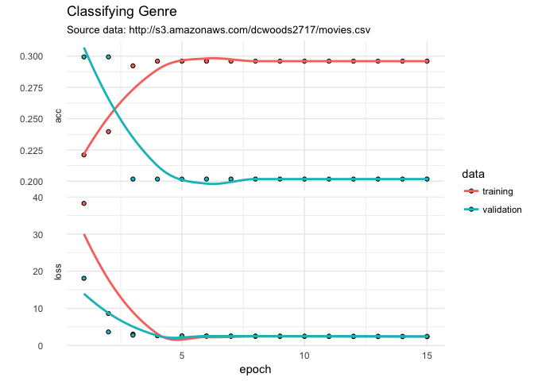

kerasformula
================
Pete Mohanty
August 17, 2018

[](https://cran.r-project.org/package=kerasformula) [](https://cranchecks.info/pkgs/kerasformula) [](https://cran.r-project.org/package=kerasformula)

kerasformula
============

Now on CRAN, `kerasformula` offers a high-level interface to [keras](https://keras.rstudio.com/) neural nets. `kerasformula` streamlines everything from data manipulation to model design to cross-validation and hyperparameter selection.

`kms`, as in `keras_model_sequential()`, is a regression-style function that lets you build `keras` neural nets with `R` `formula` objects. `kms()` accepts a number of parameters, allowing users to customize the number of units, layers, activation function, loss function, optimizer, and so on. `kms()` accepts a number of parameters (like loss and optimizer) and splits the data into (optionally sparse) test and training matrices. `kms()` facilitates setting advanced hyperparameters (e.g., dropout rate and regularization) to prevent overfitting. `kms()` optionally accept a compiled `keras_sequential_model()`. `kms()` returns a single object with predictions, a confusion matrix, and function call details.

`kms` accepts the major parameters found in `library(keras)` as inputs (loss function, batch size, number of epochs, etc.) and allows users to customize basic neural nets which, by default, now include regularizers. `kms` also accepts a compiled `keras_model_sequential` to `kms` as an argument (preferable for more complex models). The examples here (and the in the examples folder) don't provide particularly predictive models so much as show how using `formula` objects can smooth data cleaning and hyperparameter selection.

A worked example can be found on the RStudio Tensorflow website here: [Twitter data](https://tensorflow.rstudio.com/blog/analyzing-rtweet-data-with-kerasformula.html).

Getting Started
===============

`kerasformula` is now available on CRAN. It assumes both that `library(keras)` is installed and configured.

``` r
install.packages(kerasformula)
library(kerasformula)
install_keras() # see ?install_keras for install options like GPU
```

To install the development version [kerasformula](https://github.com/rdrr1990/keras),

``` r
devtools::install_github("rdrr1990/kerasformula")
```

Example: classifiying movie genre
=================================

`kms` accepts the major parameters found in `library(keras)` as inputs (loss function, batch size, number of epochs, etc.) to allows users to customize neural nets. `kms` splits training and test data into optionally-sparse matrices.`kms` also auto-detects whether the dependent variable is continuous, categorical, or binary.

AWS Movie Data with kerasformula
--------------------------------

This document shows how to fit a neural net with `kerasformula` using an Amazon AWS database of about 3,000 popular movies.

``` r
library(kerasformula)
library(ggplot2)

movies <- read.csv("http://s3.amazonaws.com/dcwoods2717/movies.csv")
dplyr::glimpse(movies)
```

    Observations: 2,961
    Variables: 11
    $ title               <fct> Over the Hill to the Poorhouse, The Broadw...
    $ genre               <fct> Crime, Musical, Comedy, Comedy, Comedy, An...
    $ director            <fct> Harry F. Millarde, Harry Beaumont, Lloyd B...
    $ year                <int> 1920, 1929, 1933, 1935, 1936, 1937, 1939, ...
    $ duration            <int> 110, 100, 89, 81, 87, 83, 102, 226, 88, 14...
    $ gross               <int> 3000000, 2808000, 2300000, 3000000, 163245...
    $ budget              <int> 100000, 379000, 439000, 609000, 1500000, 2...
    $ cast_facebook_likes <int> 4, 109, 995, 824, 352, 229, 2509, 1862, 11...
    $ votes               <int> 5, 4546, 7921, 13269, 143086, 133348, 2918...
    $ reviews             <int> 2, 107, 162, 164, 331, 349, 746, 863, 252,...
    $ rating              <dbl> 4.8, 6.3, 7.7, 7.8, 8.6, 7.7, 8.1, 8.2, 7....

How the data are cleaned affects overfitting (models that do relatively well on training data compared to test data). The first model omits director, the second includes, and the third includes dummies for top director (by frequency of appearance in the data) and codes the rest as "other".

``` r
sort(table(movies$genre))
```


       Thriller     Musical     Romance     Western      Family      Sci-Fi 
              1           2           2           2           3           7 
        Mystery Documentary     Fantasy   Animation      Horror   Biography 
             16          25          28          35         131         135 
          Crime   Adventure       Drama      Action      Comedy 
            202         288         498         738         848 

``` r
out1 <- kms(genre ~ . -title -director, movies, verbose = 0)
plot(out1$history) + labs(title = "Classifying Genre", 
                         subtitle = "Source data: http://s3.amazonaws.com/dcwoods2717/movies.csv", y="") + theme_minimal()
```



Let's fit a couple more ... Notice hyperparameters will be repeated as appropriate based on `N_layers`.

``` r
out2 <- kms(genre ~ . -title -director, movies, N_layers = 12, batch_size = 1, verbose = 0)
out3 <- kms(genre ~ rank(director) + ., movies, activation = c("tanh", "tanh", "softmax"), units=17, Nepochs = 3, verbose = 0)
```

We can have a quick look at their fit like so:

``` r
out1$evaluations$acc
```

    [1] 0.3223684

``` r
out2$evaluations$acc
```

    [1] 0.3044925

``` r
out3$evaluations$acc
```

    [1] 0.2516779

The real choice appears to be between Model 1 and Model 3 with perhaps a faint edge to Model 1. `batch_size` was set to 1 to give the estimator more of fighting chance for rare outcomes. For a more general introduction to that shows how to change loss, layer type and number, activation, etc. see package vignettes or this example using [Twitter data](https://tensorflow.rstudio.com/blog/analyzing-rtweet-data-with-kerasformula.html).

Example 2: Passing kms a Compiled Model
=======================================

This example works with some of the imdb data that comes with `library(keras)`. Specifically, this example compares the default dense model that `ksm` generates to the `lstm` model described [here](https://keras.rstudio.com/articles/examples/imdb_lstm.html). To control runtime, the number of features are limited and only a sliver of the training data is used.

``` r
max_features <- 5000 # 2,000 words (ranked by popularity) found in movie reviews
maxlen <- 50  # If applicable, 
               # cuts each user's text after 50 words (among top max_features most common words) 

cat('Loading data...\n')
```

    Loading data...

``` r
imdb <- dataset_imdb(num_words = max_features)
imdb_df <- as.data.frame(cbind(imdb$train$y, pad_sequences(imdb$train$x)))

demo_sample <- sample(nrow(imdb_df), 1000)
out_dense <- kms("V1 ~ .", data = imdb_df[demo_sample, ], Nepochs = 2, verbose = 0)
out_dense$evaluations$acc
```

    [1] 0.5195531

``` r
k <- keras_model_sequential()
k %>%
  layer_embedding(input_dim = max_features, output_dim = 128) %>% 
  layer_lstm(units = 64, dropout = 0.2, recurrent_dropout = 0.2) %>% 
  layer_dense(units = 1, activation = 'sigmoid')

k %>% compile(
  loss = 'binary_crossentropy',
  optimizer = 'adam',
  metrics = c('accuracy')
)

out_lstm = kms(input_formula = "V1 ~ .", data = imdb_df[demo_sample, ], keras_model_seq = k, Nepochs = 2, verbose = 0)
out_dense$evaluations$acc
```

    [1] 0.5195531

Goals
=====

Though `kms` contains a number of parameters, the goal is not to replace all the vast customizability that `keras` offers. Rather, like `qplot` in the `ggplot` library, `kms` offers convenience for common scenarios. Or, perhaps better, like `MCMCpack` or `rstan` do for Bayesian MCMC, `kms` aims to introduce users familiar with regression in R to neural nets without steep scripting stumbling blocks. Suggestions are more than welcome!
