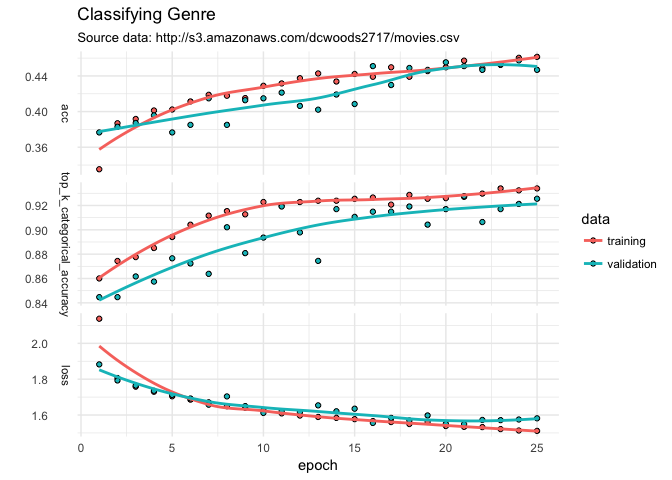
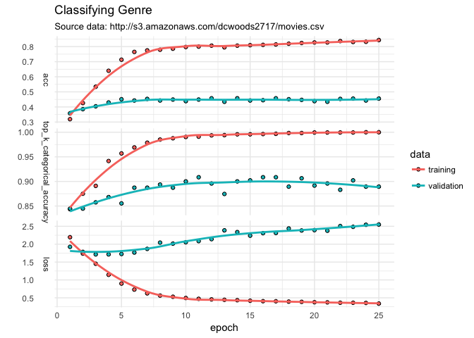
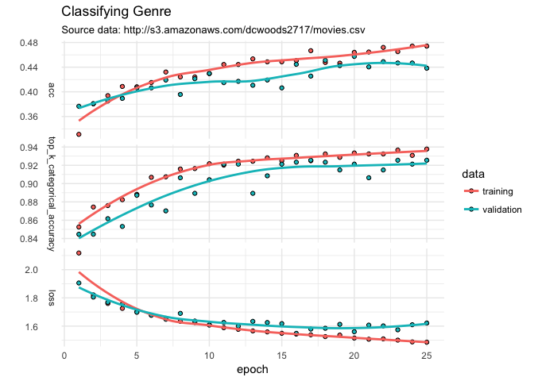

kerasformula: classification with AWS movie data
================
Pete Mohanty

AWS Movie Data with kerasformula
--------------------------------

``` r
library(kerasformula)
movies <- read.csv("http://s3.amazonaws.com/dcwoods2717/movies.csv")
dplyr::glimpse(movies)
```

    Observations: 2,961
    Variables: 11
    $ title               <fct> Over the Hill to the Poorhouse, The Broadw...
    $ genre               <fct> Crime, Musical, Comedy, Comedy, Comedy, An...
    $ director            <fct> Harry F. Millarde, Harry Beaumont, Lloyd B...
    $ year                <int> 1920, 1929, 1933, 1935, 1936, 1937, 1939, ...
    $ duration            <int> 110, 100, 89, 81, 87, 83, 102, 226, 88, 14...
    $ gross               <int> 3000000, 2808000, 2300000, 3000000, 163245...
    $ budget              <int> 100000, 379000, 439000, 609000, 1500000, 2...
    $ cast_facebook_likes <int> 4, 109, 995, 824, 352, 229, 2509, 1862, 11...
    $ votes               <int> 5, 4546, 7921, 13269, 143086, 133348, 2918...
    $ reviews             <int> 2, 107, 162, 164, 331, 349, 746, 863, 252,...
    $ rating              <dbl> 4.8, 6.3, 7.7, 7.8, 8.6, 7.7, 8.1, 8.2, 7....

Classifying Genre
-----------------

``` r
sort(table(movies$genre))
```


       Thriller     Musical     Romance     Western      Family      Sci-Fi 
              1           2           2           2           3           7 
        Mystery Documentary     Fantasy   Animation      Horror   Biography 
             16          25          28          35         131         135 
          Crime   Adventure       Drama      Action      Comedy 
            202         288         498         738         848 

``` r
out <- kms(genre ~ . -director -title, movies, seed = 12345)

plot(out$history) + labs(title = "Classifying Genre", 
                         subtitle = "Source data: http://s3.amazonaws.com/dcwoods2717/movies.csv", y="") + theme_minimal()
```



The classifier does quite well for the top five categories but struggles with rarer ones. Does adding director help?

``` r
out <- kms(genre ~ . -title, movies, seed = 12345)
```



Doesn't hurt much but introduces overfitting.... Including only the top directors doesn't make big improvements but doesn't have the overfitting issue.

``` r
movies$top50_director <- as.character(movies$director)
movies$top50_director[rank(movies$director) > 50] <- "other"
out <- kms(genre ~ . -director -title, movies, seed = 12345)
```


For a more general introduction to that shows how to change loss, layer type and number, activation, etc. see package vignettes or this example using [Twitter data](https://tensorflow.rstudio.com/blog/analyzing-rtweet-data-with-kerasformula.html).  