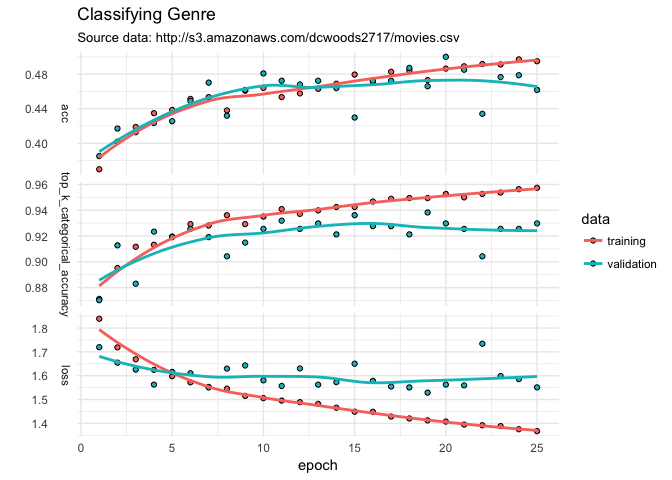
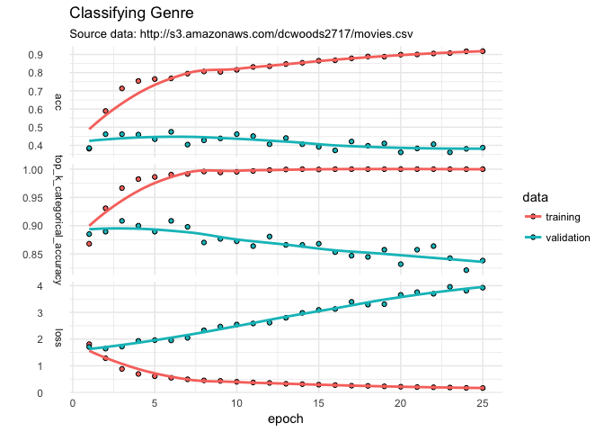
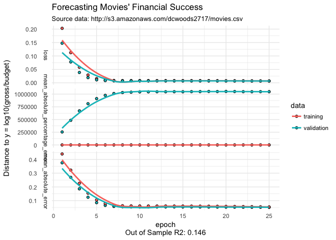
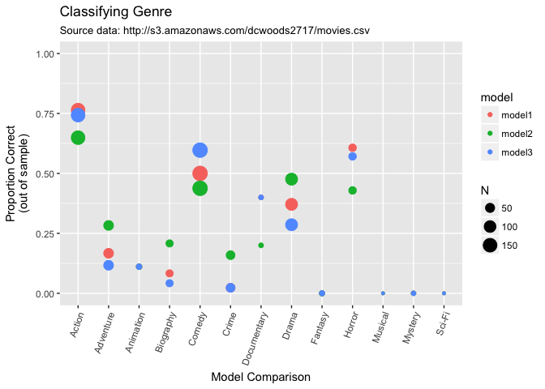

kerasformula: classification with AWS movie data
================
Pete Mohanty

AWS Movie Data with kerasformula
--------------------------------

This document shows how to fit a neural net with `kerasformula` using an Amazon AWS database of about 3,000 popular movies.

``` r
library(kerasformula)
library(ggplot2)

movies <- read.csv("http://s3.amazonaws.com/dcwoods2717/movies.csv")
dplyr::glimpse(movies)
```

    Observations: 2,961
    Variables: 11
    $ title               <fct> Over the Hill to the Poorhouse, The Broadw...
    $ genre               <fct> Crime, Musical, Comedy, Comedy, Comedy, An...
    $ director            <fct> Harry F. Millarde, Harry Beaumont, Lloyd B...
    $ year                <int> 1920, 1929, 1933, 1935, 1936, 1937, 1939, ...
    $ duration            <int> 110, 100, 89, 81, 87, 83, 102, 226, 88, 14...
    $ gross               <int> 3000000, 2808000, 2300000, 3000000, 163245...
    $ budget              <int> 100000, 379000, 439000, 609000, 1500000, 2...
    $ cast_facebook_likes <int> 4, 109, 995, 824, 352, 229, 2509, 1862, 11...
    $ votes               <int> 5, 4546, 7921, 13269, 143086, 133348, 2918...
    $ reviews             <int> 2, 107, 162, 164, 331, 349, 746, 863, 252,...
    $ rating              <dbl> 4.8, 6.3, 7.7, 7.8, 8.6, 7.7, 8.1, 8.2, 7....

How the data are cleaned affects overfitting (models that do relatively well on training data compared to test data). The first model omits director, the second includes, and the third includes dummies for top director (by frequency of appearance in the data) and codes the rest as "other".

``` r
head(sort(table(movies$director), decreasing = TRUE))
```


     Steven Spielberg    Clint Eastwood   Martin Scorsese        Tim Burton 
                   23                19                16                16 
            Spike Lee Steven Soderbergh 
                   15                15 

``` r
sum(table(movies$director) == 1)          # number of directors appearing only once
```

    [1] 788

Classifying Genre
-----------------

``` r
sort(table(movies$genre))
```


       Thriller     Musical     Romance     Western      Family      Sci-Fi 
              1           2           2           2           3           7 
        Mystery Documentary     Fantasy   Animation      Horror   Biography 
             16          25          28          35         131         135 
          Crime   Adventure       Drama      Action      Comedy 
            202         288         498         738         848 

``` r
out1 <- kms(genre ~ . -director -title, movies, batch_size = 1, seed = 12345)

plot(out1$history) + labs(title = "Classifying Genre", 
                         subtitle = "Source data: http://s3.amazonaws.com/dcwoods2717/movies.csv", y="") + theme_minimal()
```



The model is only able to classify about half the movies by genre correctly. Does adding director help?

``` r
out2 <- kms(genre ~ . -title, movies, batch_size = 1, seed = 12345)
```



Doesn't hurt much but introduces overfitting.... Including only the top directors doesn't make big improvements but doesn't have the overfitting issue.

``` r
movies$top50_director <- as.character(movies$director)
movies$top50_director[rank(movies$director) > 50] <- "other"
out3 <- kms(genre ~ . -director -title, movies, batch_size = 1, seed = 12345)
```



What's going on? The above plots show epoch-by-epoch training data vis-a-vis validation data. By default, `kms` holds out an additional 20% of the data as test data. That test data is used to construct a confusion matrix, or, when there are many categories, a table that reports the proportion correct as well as most common errors (`?confusion` for options). For example, comedies are most likely to be mistaken for dramas and actions for comedies. Biographies, a relatively rare category, are usually mistakan for dramas.

``` r
out1$confusion
```

             label   N pCorrect    MCE  pMCE      MCE2 pMCE2 pOther
    1      Musical   1    0.000 Comedy 1.000      <NA> 0.000  0.000
    2       Comedy 176    0.500 Action 0.290     Drama 0.142  0.068
    3        Drama 105    0.371 Action 0.257    Comedy 0.257  0.114
    4       Horror  28    0.607 Action 0.179    Comedy 0.107  0.107
    5        Crime  44    0.023 Action 0.386    Comedy 0.227  0.364
    6    Adventure  60    0.167 Action 0.450    Comedy 0.150  0.233
    7    Biography  24    0.083  Drama 0.583    Action 0.167  0.167
    8       Action 148    0.764 Comedy 0.115     Drama 0.068  0.054
    9       Sci-Fi   1    0.000 Action 1.000      <NA> 0.000  0.000
    10     Fantasy   7    0.000 Horror 0.571    Action 0.286  0.143
    11     Mystery   4    0.000 Action 0.500     Drama 0.250  0.250
    12   Animation   9    0.111 Action 0.444 Adventure 0.333  0.111
    13 Documentary   5    0.400 Action 0.200    Comedy 0.200  0.200

That means we can visualize the models' confusion like so:

``` r
out1$confusion$model <- "model1"
out2$confusion$model <- "model2"
out3$confusion$model <- "model3"

cf <- dplyr::bind_rows(out1$confusion, out2$confusion, out3$confusion)

ggplot(cf, aes(x = label, y = pCorrect, col=model, size=N)) + geom_point() + theme(axis.text.x = element_text(angle = 70, hjust = 1)) + ylim(c(0,1)) + 
  labs(y = "Proportion Correct\n(out of sample)", x="Model Comparison", title = "Classifying Genre", subtitle = "Source data: http://s3.amazonaws.com/dcwoods2717/movies.csv")
```



The real choice appears to be between Model 1 and Model 3 with perhaps a faint edge to Model 1. `batch_size` was set to 1 to give the estimator more of fighting chance for rare outcomes. For a more general introduction to that shows how to change loss, layer type and number, activation, etc. see package vignettes or this example using [Twitter data](https://tensorflow.rstudio.com/blog/analyzing-rtweet-data-with-kerasformula.html).
