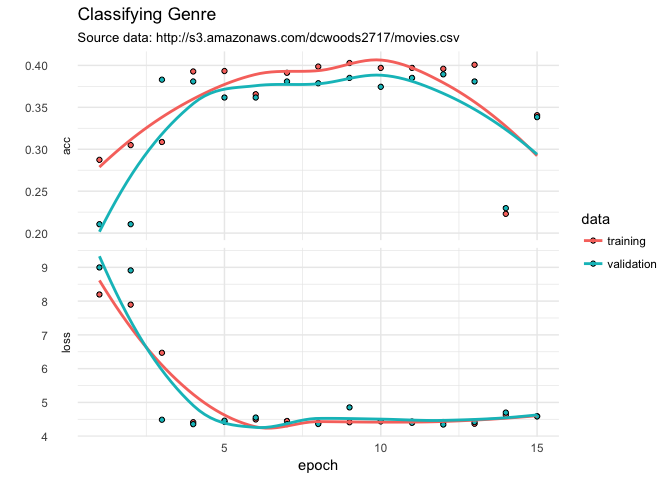
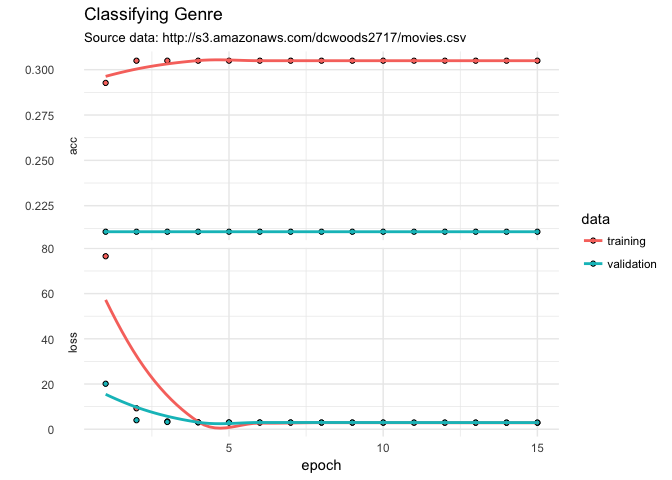
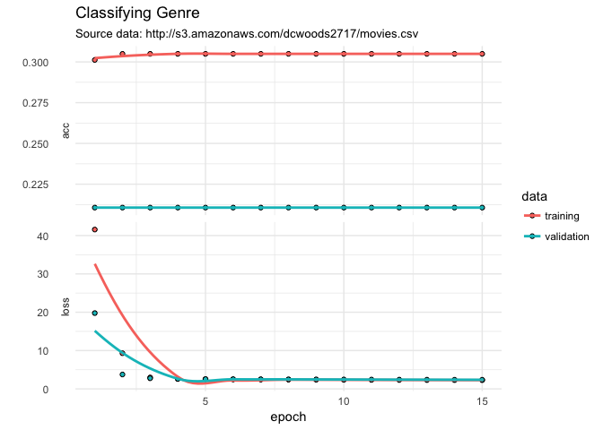
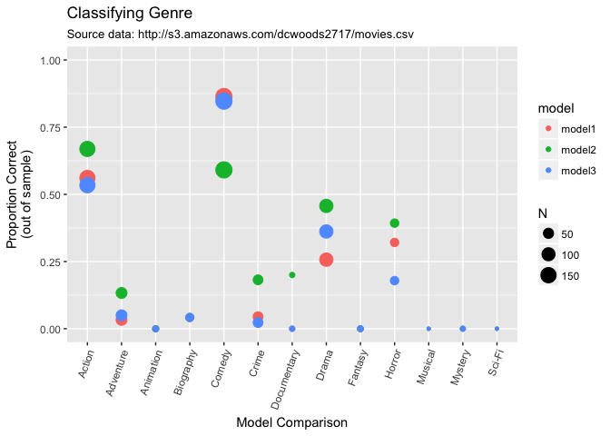

kerasformula: classification with AWS movie data
================
Pete Mohanty

AWS Movie Data with kerasformula
--------------------------------

This document shows how to fit a neural net with `kerasformula` using an Amazon AWS database of about 3,000 popular movies.

``` r
library(kerasformula)
library(ggplot2)

movies <- read.csv("http://s3.amazonaws.com/dcwoods2717/movies.csv")
dplyr::glimpse(movies)
```

    Observations: 2,961
    Variables: 11
    $ title               <fct> Over the Hill to the Poorhouse, The Broadw...
    $ genre               <fct> Crime, Musical, Comedy, Comedy, Comedy, An...
    $ director            <fct> Harry F. Millarde, Harry Beaumont, Lloyd B...
    $ year                <int> 1920, 1929, 1933, 1935, 1936, 1937, 1939, ...
    $ duration            <int> 110, 100, 89, 81, 87, 83, 102, 226, 88, 14...
    $ gross               <int> 3000000, 2808000, 2300000, 3000000, 163245...
    $ budget              <int> 100000, 379000, 439000, 609000, 1500000, 2...
    $ cast_facebook_likes <int> 4, 109, 995, 824, 352, 229, 2509, 1862, 11...
    $ votes               <int> 5, 4546, 7921, 13269, 143086, 133348, 2918...
    $ reviews             <int> 2, 107, 162, 164, 331, 349, 746, 863, 252,...
    $ rating              <dbl> 4.8, 6.3, 7.7, 7.8, 8.6, 7.7, 8.1, 8.2, 7....

How the data are cleaned affects overfitting (models that do relatively well on training data compared to test data). The first model omits director, the second includes, and the third includes dummies for top director (by frequency of appearance in the data) and codes the rest as "other". In general with neural nets, overfitting is the big concern. Here, we only have a relatively small number of columns and so the regularizers are disabled (as opposed to their default, L1).

``` r
head(sort(table(movies$director), decreasing = TRUE))
```


     Steven Spielberg    Clint Eastwood   Martin Scorsese        Tim Burton 
                   23                19                16                16 
            Spike Lee Steven Soderbergh 
                   15                15 

``` r
sum(table(movies$director) == 1)          # number of directors appearing only once
```

    [1] 788

Classifying Genre
-----------------

``` r
sort(table(movies$genre))
```


       Thriller     Musical     Romance     Western      Family      Sci-Fi 
              1           2           2           2           3           7 
        Mystery Documentary     Fantasy   Animation      Horror   Biography 
             16          25          28          35         131         135 
          Crime   Adventure       Drama      Action      Comedy 
            202         288         498         738         848 

``` r
out1 <- kms(genre ~ . -director -title, movies, seed = 12345, activation = "relu", use_bias = FALSE, kernel_regularizer = NULL, bias_regularizer = NULL, activity_regularizer = NULL)
```

           units activation dropout use_bias kernel_initializer embedding
    layer1   256       relu     0.4    FALSE     glorot_uniform     FALSE
    layer2   128       relu     0.4    FALSE     glorot_uniform        NA
    layer3    17       relu     0.0    FALSE     glorot_uniform        NA
    ___________________________________________________________________________
    Layer (type)                     Output Shape                  Param #     
    ===========================================================================
    dense_1 (Dense)                  (None, 256)                   2048        
    ___________________________________________________________________________
    dense_2 (Dense)                  (None, 256)                   65536       
    ___________________________________________________________________________
    dropout_1 (Dropout)              (None, 256)                   0           
    ___________________________________________________________________________
    dense_3 (Dense)                  (None, 128)                   32768       
    ___________________________________________________________________________
    dropout_2 (Dropout)              (None, 128)                   0           
    ___________________________________________________________________________
    dense_4 (Dense)                  (None, 17)                    2176        
    ===========================================================================
    Total params: 102,528
    Trainable params: 102,528
    Non-trainable params: 0
    ___________________________________________________________________________

``` r
plot(out1$history) + labs(title = "Classifying Genre", 
                         subtitle = "Source data: http://s3.amazonaws.com/dcwoods2717/movies.csv", y="") + theme_minimal()
```



The model is only able to classify about half the movies by genre correctly. Does adding director help?

``` r
out2 <- kms(genre ~ . -title, movies, activation = "relu", seed = 12345, use_bias = FALSE, kernel_regularizer = NULL, bias_regularizer = NULL, activity_regularizer = NULL)
```

           units activation dropout use_bias kernel_initializer embedding
    layer1   256       relu     0.4    FALSE     glorot_uniform     FALSE
    layer2   128       relu     0.4    FALSE     glorot_uniform        NA
    layer3    17       relu     0.0    FALSE     glorot_uniform        NA
    ___________________________________________________________________________
    Layer (type)                     Output Shape                  Param #     
    ===========================================================================
    dense_1 (Dense)                  (None, 256)                   351488      
    ___________________________________________________________________________
    dense_2 (Dense)                  (None, 256)                   65536       
    ___________________________________________________________________________
    dropout_1 (Dropout)              (None, 256)                   0           
    ___________________________________________________________________________
    dense_3 (Dense)                  (None, 128)                   32768       
    ___________________________________________________________________________
    dropout_2 (Dropout)              (None, 128)                   0           
    ___________________________________________________________________________
    dense_4 (Dense)                  (None, 17)                    2176        
    ===========================================================================
    Total params: 451,968
    Trainable params: 451,968
    Non-trainable params: 0
    ___________________________________________________________________________



Doesn't hurt much but introduces overfitting.... Including only the top directors doesn't make big improvements but doesn't have the overfitting issue.

``` r
movies$top50_director <- as.character(movies$director)
movies$top50_director[rank(movies$director) > 50] <- "other"
out3 <- kms(genre ~ . -director -title, movies, activation = "relu", seed = 12345, use_bias = FALSE, kernel_regularizer = NULL, bias_regularizer = NULL, activity_regularizer = NULL)
```

           units activation dropout use_bias kernel_initializer embedding
    layer1   256       relu     0.4    FALSE     glorot_uniform     FALSE
    layer2   128       relu     0.4    FALSE     glorot_uniform        NA
    layer3    17       relu     0.0    FALSE     glorot_uniform        NA
    ___________________________________________________________________________
    Layer (type)                     Output Shape                  Param #     
    ===========================================================================
    dense_1 (Dense)                  (None, 256)                   9216        
    ___________________________________________________________________________
    dense_2 (Dense)                  (None, 256)                   65536       
    ___________________________________________________________________________
    dropout_1 (Dropout)              (None, 256)                   0           
    ___________________________________________________________________________
    dense_3 (Dense)                  (None, 128)                   32768       
    ___________________________________________________________________________
    dropout_2 (Dropout)              (None, 128)                   0           
    ___________________________________________________________________________
    dense_4 (Dense)                  (None, 17)                    2176        
    ===========================================================================
    Total params: 109,696
    Trainable params: 109,696
    Non-trainable params: 0
    ___________________________________________________________________________



What's going on? The above plots show epoch-by-epoch training data vis-a-vis validation data. By default, `kms` holds out an additional 20% of the data as test data. That test data is used to construct a confusion matrix, or, when there are many categories, a table that reports the proportion correct as well as most common errors (`?confusion` for options). For example, comedies are most likely to be mistaken for dramas and actions for comedies. Biographies, a relatively rare category, are usually mistakan for dramas.

``` r
out1$confusion
```

                     
                      Action_pred Adventure_pred Animation_pred Biography_pred
      Action_obs                0              0              0              0
      Adventure_obs             0              0              0              0
      Animation_obs             0              0              0              0
      Biography_obs             0              0              0              0
      Comedy_obs                0              0              0              0
      Crime_obs                 0              0              0              0
      Documentary_obs           0              0              0              0
      Drama_obs                 0              0              0              0
      Family_obs                0              0              0              0
      Fantasy_obs               0              0              0              0
      Horror_obs                0              0              0              0
      Musical_obs               0              0              0              0
      Mystery_obs               0              0              0              0
      Romance_obs               0              0              0              0
      Sci-Fi_obs                0              0              0              0
      Thriller_obs              0              0              0              0
      Western_obs               0              0              0              0
                     
                      Comedy_pred Crime_pred Documentary_pred Drama_pred
      Action_obs              148          0                0          0
      Adventure_obs            60          0                0          0
      Animation_obs             9          0                0          0
      Biography_obs            24          0                0          0
      Comedy_obs              176          0                0          0
      Crime_obs                44          0                0          0
      Documentary_obs           5          0                0          0
      Drama_obs               105          0                0          0
      Family_obs                0          0                0          0
      Fantasy_obs               7          0                0          0
      Horror_obs               28          0                0          0
      Musical_obs               1          0                0          0
      Mystery_obs               4          0                0          0
      Romance_obs               0          0                0          0
      Sci-Fi_obs                1          0                0          0
      Thriller_obs              0          0                0          0
      Western_obs               0          0                0          0
                     
                      Family_pred Fantasy_pred Horror_pred Musical_pred
      Action_obs                0            0           0            0
      Adventure_obs             0            0           0            0
      Animation_obs             0            0           0            0
      Biography_obs             0            0           0            0
      Comedy_obs                0            0           0            0
      Crime_obs                 0            0           0            0
      Documentary_obs           0            0           0            0
      Drama_obs                 0            0           0            0
      Family_obs                0            0           0            0
      Fantasy_obs               0            0           0            0
      Horror_obs                0            0           0            0
      Musical_obs               0            0           0            0
      Mystery_obs               0            0           0            0
      Romance_obs               0            0           0            0
      Sci-Fi_obs                0            0           0            0
      Thriller_obs              0            0           0            0
      Western_obs               0            0           0            0
                     
                      Mystery_pred Romance_pred Sci-Fi_pred Thriller_pred
      Action_obs                 0            0           0             0
      Adventure_obs              0            0           0             0
      Animation_obs              0            0           0             0
      Biography_obs              0            0           0             0
      Comedy_obs                 0            0           0             0
      Crime_obs                  0            0           0             0
      Documentary_obs            0            0           0             0
      Drama_obs                  0            0           0             0
      Family_obs                 0            0           0             0
      Fantasy_obs                0            0           0             0
      Horror_obs                 0            0           0             0
      Musical_obs                0            0           0             0
      Mystery_obs                0            0           0             0
      Romance_obs                0            0           0             0
      Sci-Fi_obs                 0            0           0             0
      Thriller_obs               0            0           0             0
      Western_obs                0            0           0             0
                     
                      Western_pred
      Action_obs                 0
      Adventure_obs              0
      Animation_obs              0
      Biography_obs              0
      Comedy_obs                 0
      Crime_obs                  0
      Documentary_obs            0
      Drama_obs                  0
      Family_obs                 0
      Fantasy_obs                0
      Horror_obs                 0
      Musical_obs                0
      Mystery_obs                0
      Romance_obs                0
      Sci-Fi_obs                 0
      Thriller_obs               0
      Western_obs                0

That means we can visualize the models' confusion like so:

``` r
plot_confusion(model1, model2, model3, title="Classifying Genre", subtitle="Source Data: http://s3.amazonaws.com/dcwoods2717/movies.csv")
```



The real choice appears to be between Model 1 and Model 3 with perhaps a faint edge to Model 1. `batch_size` was set to 1 to give the estimator more of fighting chance for rare outcomes. For a more general introduction to that shows how to change loss, layer type and number, activation, etc. see package vignettes or this example using [Twitter data](https://tensorflow.rstudio.com/blog/analyzing-rtweet-data-with-kerasformula.html).
