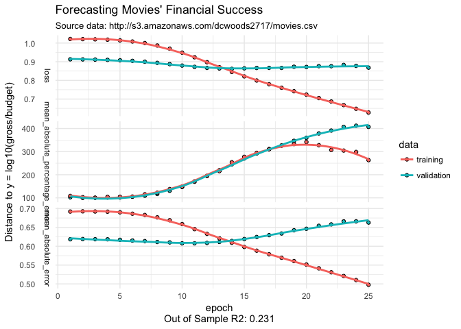
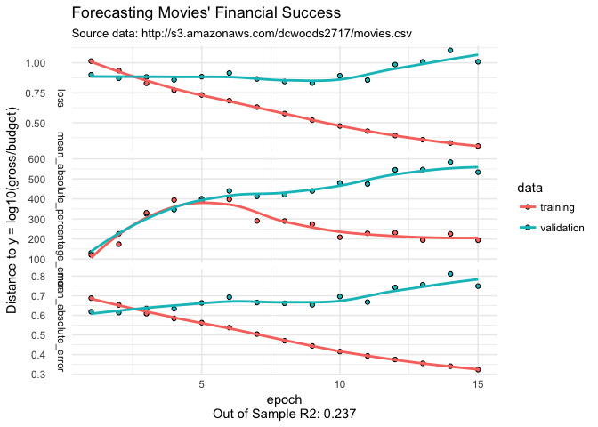

kerasformula on AWS movie data
================
Pete Mohanty

When `kms` detects that `y` is continuous, it performs a regression. By default, the first layer is relu, the second softmax, and the third is linear (the final layer should be linear even if others are not). `kms` defaults to mean squared error loss but reports that alongside mean absolute error and mean absolute percentage loss.

This document shows how to fit a model and then focuses on bacth size... For a more general introduction to that shows how to change loss, layer type and number, activation, etc. see package vignettes or this example using [Twitter data](https://tensorflow.rstudio.com/blog/analyzing-rtweet-data-with-kerasformula.html).

AWS Movie Data with kerasformula
--------------------------------

``` r
library(kerasformula)
movies <- read.csv("http://s3.amazonaws.com/dcwoods2717/movies.csv")
dplyr::glimpse(movies)
```

    Observations: 2,961
    Variables: 11
    $ title               <fct> Over the Hill to the Poorhouse, The Broadw...
    $ genre               <fct> Crime, Musical, Comedy, Comedy, Comedy, An...
    $ director            <fct> Harry F. Millarde, Harry Beaumont, Lloyd B...
    $ year                <int> 1920, 1929, 1933, 1935, 1936, 1937, 1939, ...
    $ duration            <int> 110, 100, 89, 81, 87, 83, 102, 226, 88, 14...
    $ gross               <int> 3000000, 2808000, 2300000, 3000000, 163245...
    $ budget              <int> 100000, 379000, 439000, 609000, 1500000, 2...
    $ cast_facebook_likes <int> 4, 109, 995, 824, 352, 229, 2509, 1862, 11...
    $ votes               <int> 5, 4546, 7921, 13269, 143086, 133348, 2918...
    $ reviews             <int> 2, 107, 162, 164, 331, 349, 746, 863, 252,...
    $ rating              <dbl> 4.8, 6.3, 7.7, 7.8, 8.6, 7.7, 8.1, 8.2, 7....

Predicting Profitability
------------------------

Suppose we are interested in revenue relative to budget... Since `y = log10(gross/budget)`, `y = 0` means "break even."  Let's predict `log10(gross/budget)`... Since the logged data looks approximately normal, let's go ahead and stardadize it too...

``` r
out <- kms(log10(gross/budget) ~ . -title, movies, seed=123, scale="z")
```



Overfitting sets in after 15 or so epochs. Ideally, all of these measures should tend to zero, so something is going wrong. Notice that overfitting is mild when measured in terms of the loss function when compared to the other metrics. Let's look at some diagnostics...

``` r
out$MSE_predictions
```

    [1] 0.6969778

``` r
out$MAE_predictions
```

    [1] 0.5878382

``` r
out$R2_predictions     # Pearson's
```

              [,1]
    [1,] 0.2306727

``` r
out$cor_kendals^2        # suggests Pearson's R2, while grim, is optimistic...
```

              [,1]
    [1,] 0.1226422

``` r
range(out$y_test)
```

    [1] -2.803288  3.369618

``` r
range(out$predictions)   # standardized N(0,1)
```

    [1] -0.7761067  0.8108339

The issue is that all of the predictions are concentrated in a very narrow range that ignores outcomes in the tails. Let's drop the batch size too.

``` r
out <- kms(log10(gross/budget) ~ . -title, movies, seed=123, scale="z", batch_size = 1, Nepochs = 15)
```



``` r
out$R2_predictions     # Pearson's
```

              [,1]
    [1,] 0.2371502

``` r
out$cor_kendals^2      # Pearson's R2, while grim, is optimistic...
```

              [,1]
    [1,] 0.1084557

``` r
range(out$y_test)
```

    [1] -2.803288  3.369618

``` r
range(out$predictions)   # standardized N(0,1)
```

    [1] -1.981033  1.559968

Big step in the right direction! The range of the predictions is now more similar to that of `y_test` but not all the way there. Does it simply need to run longer?

``` r
out <- kms(log10(gross/budget) ~ . -director -title, movies, seed=123, scale="z", batch_size = 1, Nepochs = 100)
```


``` r
out$R2_predictions     # Pearson's
```

              [,1]
    [1,] 0.2722576

``` r
out$cor_kendals^2      # Pearson's R2, while grim, is optimistic...
```

              [,1]
    [1,] 0.1199743

``` r
range(out$y_test)
```

    [1] -2.803288  3.369618

``` r
range(out$predictions)   # standardized N(0,1)
```

    [1] -2.620781  3.755888

Letting the model run for a large number of epochs doesn't improve overall accuracy much but does seem to enable the model to make predictions in the tails (extremely profitable vs. extremely unprofitable movies). Striking that balance is a difficult one in practice but this example suggests it is well worth looking past the headlines of average loss.
