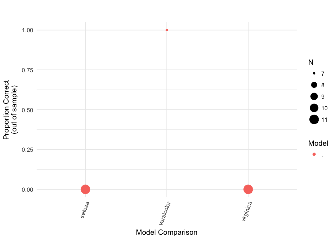

piping data into kerasformula
================
Pete
9/4/2018

`kms` is written to be consistent in style with `R` functions like `lm`, which take a formula as the first argument. However, data can still be piped in. Since the object coming down the pipe will become the first *unnamed* argument and the `data` is the second argument, simply name `input_formula` like so:

``` r
library(kerasformula)
library(dplyr)

iris %>% 
    kms(input_formula = "Species ~ .", units=4, seed=123, verbose=0) -> 
out 
out %>% plot_confusion
```


