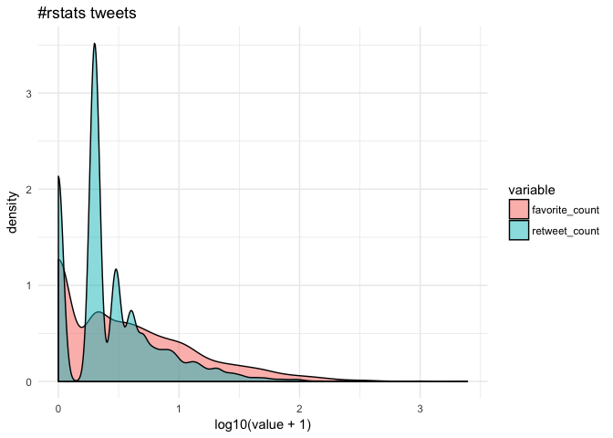
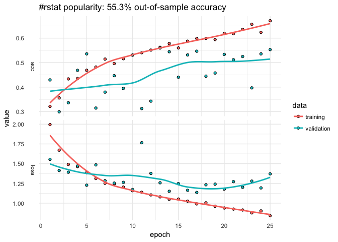
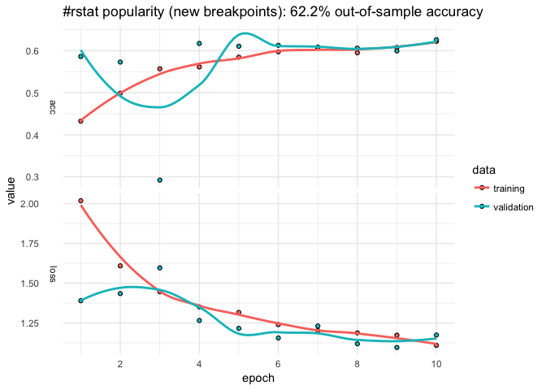
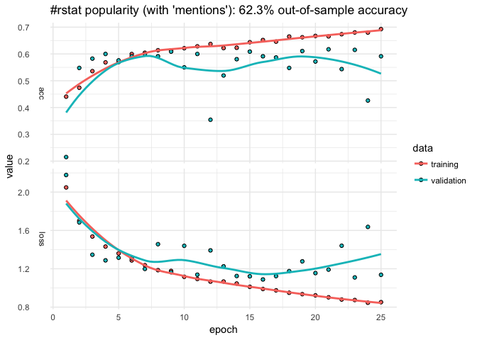
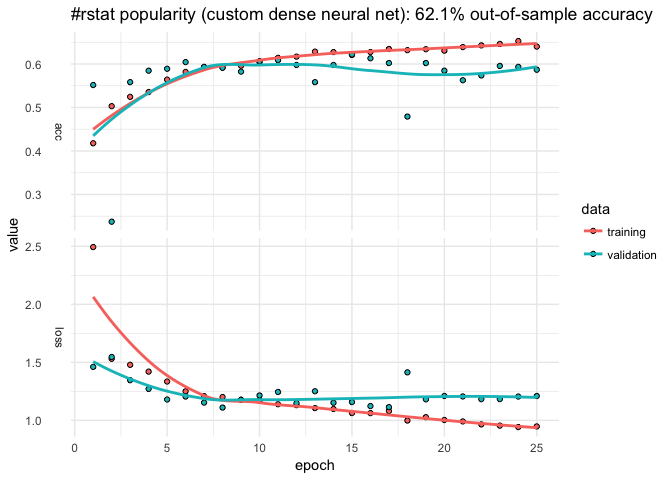

Analyzing rtweet data with kerasformula
================
Pete Mohanty

``` r
library(knitr)
opts_chunk$set(comment = "", message = FALSE, warning = FALSE)
```

Overview
--------

The [kerasformula](https://cran.r-project.org/web/packages/kerasformula/index.html) package offers a high-level interface for the R interface to [Keras](https://keras.rstudio.com). It's main interface is the `kms` function, a regression-style interface to `keras_model_sequential` that uses formulas and sparse matrices.

The [kerasformula](https://cran.r-project.org/web/packages/kerasformula/index.html) package is available on CRAN, and can be installed with:

``` r
# install the kerasformula package
install.packages("kerasformula")

# install the core keras library (if you haven't already done so)
# see ?install_keras() for options e.g. install_keras(tensorflow = "gpu")
library(keras)
install_keras()
```

The kms() function
------------------

Many classic machine learning tutorials assume that data come in a relatively homogenous form (e.g., pixels for digit recognition or word counts or ranks) which can make coding somewhat cumbersome when data is contained in a heterogenous data frame. `kms()` takes advantage of the flexibility of R formulas to smooth this process.

`kms` builds dense neural nets and, after fitting them, returns a single object with predictions, measures of fit, and details about the function call. `kms` accepts a number of parameters including the loss and activation functions found in `keras`. `kms` also accepts compiled `keras_model_sequential` objects allowing for even further customization. This little demo shows how `kms` can aid is model building and hyperparameter selection (e.g., batch size) starting with raw data gathered using `library(rtweet)`.

Let's look at \#rstats tweets (excluding retweets) for a six-day period ending January 24, 2018 at 10:24. This happens to give us a nice reasonable number of observations to work with in terms of runtime (and the purpose of this document is to show syntax, not build particularly predictive models).

``` r
rstats <- search_tweets("#rstats", n = 10000, include_rts = FALSE)
dim(rstats)
```

    [1] 2834   42

Suppose our goal is to predict how popular tweets will be based on how often the tweet was retweeted and favorited (which correlate strongly).

``` r
cor(rstats$favorite_count, rstats$retweet_count, method="spearman")
```

    [1] 0.7069454

Since few tweeets go viral, the data are quite skewed towards zero.



Getting the most out of formulas
--------------------------------

Let's suppose we are interested in putting tweets into categories based on popularity but we're not sure how finely-grained we want to make distinctions. Some of the data, like `rstats$mentions_screen_name` comes in a list of varying lengths, so let's write a helper function to count non-NA entries.

``` r
n <- function(x) {
  unlist(lapply(x, function(y){length(y) - is.na(y[1])}))
}
```

Let's start with a dense neural net, the default of `kms`. We can use base R functions to help clean the data--in this case, `cut` to discretize the outcome, `grepl` to look for key words, and `weekdays` and `format` to capture different aspects of the time the tweet was posted.

``` r
breaks <- c(-1, 0, 1, 10, 100, 1000, 10000)
popularity <- kms(cut(retweet_count + favorite_count, breaks) ~ screen_name + source +  
                          n(hashtags) + n(mentions_screen_name) + 
                          n(urls_url) + nchar(text) +
                          grepl('photo', media_type) +
                          weekdays(created_at) + 
                          format(created_at, '%H'), rstats)
plot(popularity$history) + ggtitle(paste("#rstat popularity:",
                                         paste0(round(100*popularity$evaluations$acc, 1), "%"),
                                         "out-of-sample accuracy")) + theme_minimal()
```



``` r
popularity$confusion
```

                   
                    (-1,0] (0,1] (1,10] (10,100] (100,1e+03] (1e+03,1e+04]
      (-1,0]            34    12     28        3           0             0
      (0,1]             13    20     64        7           0             0
      (1,10]             3    12    180       38           0             0
      (10,100]           0     0     44       59           0             0
      (100,1e+03]        0     0      5        8           0             0
      (1e+03,1e+04]      0     0      0        0           0             0

The model only classifies about 55.3% of the out-of-sample data correctly. The confusion matrix suggests that model does best with tweets that aren't retweeted but struggles with others. The `history` plot also suggests that out-of-sample accuracy is not very stable. We can easily change the breakpoints and number of epochs.

``` r
breaks <- c(-1, 0, 1, 25, 50, 75, 100, 500, 1000, 10000)
popularity <- kms(cut(retweet_count + favorite_count, breaks) ~  
                          n(hashtags) + n(mentions_screen_name) + n(urls_url) +
                          nchar(text) +
                          screen_name + source +
                          grepl('photo', media_type) +
                          weekdays(created_at) + 
                          format(created_at, '%H'), rstats, Nepochs = 10)
plot(popularity$history) + ggtitle(paste("#rstat popularity (new breakpoints):",
                                         paste0(round(100*popularity$evaluations$acc, 1), "%"),
                                         "out-of-sample accuracy")) + theme_minimal()
```



Suppose we want to add a little more data. Let's first store the input formula.

``` r
pop_input <- "cut(retweet_count + favorite_count, breaks) ~  
                          n(hashtags) + n(mentions_screen_name) + n(urls_url) +
                          nchar(text) +
                          screen_name + source +
                          grepl('photo', media_type) +
                          weekdays(created_at) + 
                          format(created_at, '%H')"
```

Here we use `paste0` to add to the formula by looping over user IDs adding something like:

    grepl("12233344455556", mentions_user_id)

``` r
mentions <- unlist(rstats$mentions_user_id)
mentions <- unique(mentions[which(table(mentions) > 5)]) # remove infrequent mentions
mentions <- mentions[!is.na(mentions)] # drop NA

for(i in mentions)
  pop_input <- paste0(pop_input, " + ", "grepl(", i, ", mentions_user_id)")

popularity <- kms(pop_input, rstats)
```



Customizing layers with kms()
-----------------------------

We could add more data, perhaps add individual words from the text or some other summary stat (`mean(text %in% LETTERS)` to see if all caps explains popularity). But let's alter the neural net.

The `input.formula` is used to create a sparse model matrix. For example, `rstats$source` (Twitter or Twitter-client application type) and `rstats$screen_name` are character vectors that will be dummied out. How many columns does it have?

``` r
popularity$P
```

    [1] 1269

Say we wanted to reshape the layers to transition more gradually from the input shape to the output.

``` r
popularity <- kms(pop_input, rstats,
                  layers = list(units = c(1024, 512, 256, 128, NA),
                                activation = c("relu", "relu", "relu", "relu", "softmax"), 
                                dropout = c(0.5, 0.45, 0.4, 0.35, NA)))
```



`kms` builds a `keras_sequential_model()`, which is a stack of linear layers. The input shape is determined by the dimensionality of the model matrix (`popularity$P`) but after that users are free to determine the number of layers and so on. The `kms` argument `layers` expects a list, the first entry of which is a vector `units` with which to call `keras::layer_dense()`. The first element the number of `units` in the first layer, the second element for the second layer, and so on (`NA` as the final element connotes to auto-detect the final number of units based on the observed number of outcomes). `activation` is also passed to `layer_dense()` and may take values such as `softmax`, `relu`, `elu`, and `linear`. (`kms` also has a separate parameter to control the optimizer; by default `kms(... optimizer = 'rms_prop')`.) The `dropout` that follows each dense layer rate prevents overfitting (but of course isn't applicable to the final layer).

Choosing a Batch Size
---------------------

By default, `kms` uses batches of 32. Suppose we were happy with our model but didn't have any particular intuition about what the size should be.

``` r
Nbatch <- c(16, 32, 64)
Nruns <- 4
accuracy <- matrix(nrow = Nruns, ncol = length(Nbatch))
colnames(accuracy) <- paste0("Nbatch_", Nbatch)

est <- list()
for(i in 1:Nruns){
  for(j in 1:length(Nbatch)){
   est[[i]] <- kms(pop_input, rstats, Nepochs = 2, batch_size = Nbatch[j])
   accuracy[i,j] <- est[[i]][["evaluations"]][["acc"]]
  }
}
  
colMeans(accuracy)
```

    Nbatch_16 Nbatch_32 Nbatch_64 
    0.4765693 0.4315487 0.5604840 

For the sake of curtailing runtime, the number of epochs has been set arbitrarily short but, from those results, 64 is the best batch size.

Making predictions for new data
-------------------------------

Thus far, we have been using the default settings for `kms` which first splits data into 80% training and 20% testing. Of the 80% training, a certain portion is set aside for validation and that's what produces the epoch-by-epoch graphs of loss and accuracy. The 20% is only used at the end to assess predictive accuracy. But suppose you wanted to make predictions on a new data set...

``` r
popularity <- kms(pop_input, rstats[1:1000,])
predictions <- predict(popularity, rstats[1001:2000,])
predictions$confusion
```

                   
                    (-1,0] (0,1] (1,25] (25,50] (50,75] (75,100] (100,500]
      (-1,0]            53    39     50       0       0        0         0
      (0,1]             37    41    120       0       0        0         0
      (1,25]            20    45    462       0      10        0         0
      (25,50]            0     0     50       0       3        0         0
      (50,75]            0     2     20       0       2        0         0
      (75,100]           0     1     12       0       0        0         0
      (100,500]          0     0     27       0       2        0         0
      (500,1e+03]        0     0      4       0       0        0         0
      (1e+03,1e+04]      0     0      0       0       0        0         0
                   
                    (500,1e+03] (1e+03,1e+04]
      (-1,0]                  0             0
      (0,1]                   0             0
      (1,25]                  0             0
      (25,50]                 0             0
      (50,75]                 0             0
      (75,100]                0             0
      (100,500]               0             0
      (500,1e+03]             0             0
      (1e+03,1e+04]           0             0

``` r
predictions$accuracy
```

    [1] 0.558

Because the formula creates a dummy variable for each screen name and mention, any given set of tweets is all but guaranteed to have different columns. `predict.kms_fit` is an `S3 method` that takes the new data and constructs a (sparse) model matrix that preserves the original structure of the training matrix. `predict` then returns the predictions along with a confusion matrix and accuracy score.

If your newdata has the same observed levels of y and columns of x\_train (the model matrix), you can also use `keras::predict_classes` on `object$model`.

Using a compiled Keras model
----------------------------

This section shows how to input a model compiled in the fashion typical to `library(keras)`, which is useful for more advanced models. Here is an example for `lstm` analogous to the [imbd with Keras example](https://tensorflow.rstudio.com/keras/articles/examples/imdb_lstm.html).

``` r
k <- keras_model_sequential()
k %>%
  layer_embedding(input_dim = popularity$P, output_dim = popularity$P) %>% 
  layer_lstm(units = 512, dropout = 0.4, recurrent_dropout = 0.2) %>% 
  layer_dense(units = 256, activation = "relu") %>%
  layer_dropout(0.3) %>%
  layer_dense(units = 8, # number of levels observed on y (outcome)  
              activation = 'sigmoid')

k %>% compile(
  loss = 'categorical_crossentropy',
  optimizer = 'rmsprop',
  metrics = c('accuracy')
)

popularity_lstm <- kms(pop_input, rstats, k)
```
