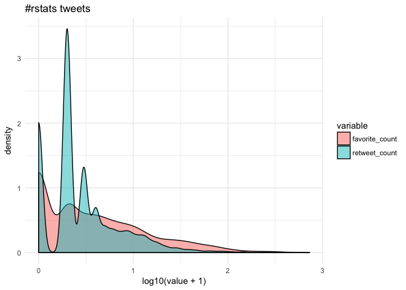
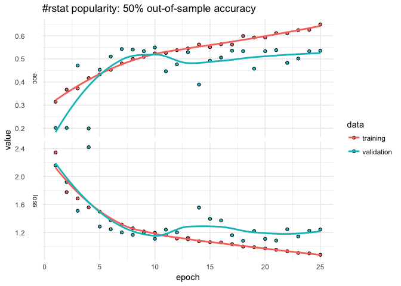
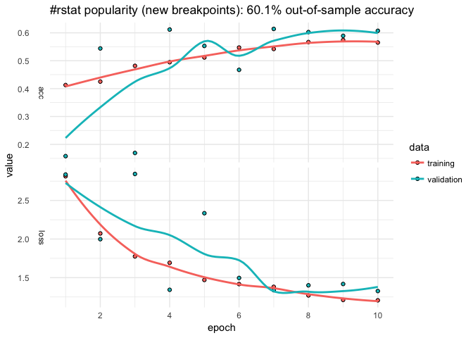
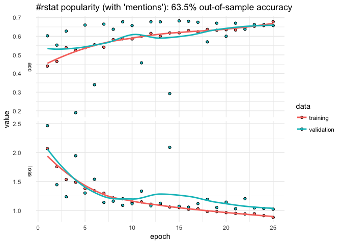
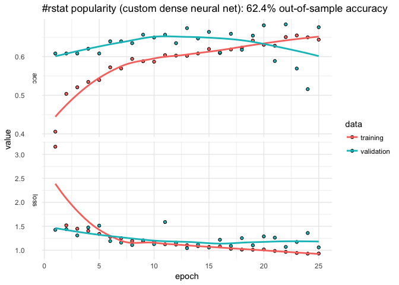

Analyzing rtweet data with kerasformula
================
Pete Mohanty

This document introduces `kms`, the main function of `library(kerasformula)`. Newly on `CRAN`, `kerasformula` offers a high-level interface for `library(keras)`. Many classic machine learning tutorials assume that data come in a relatively homogenous form (e.g., pixels for digit recognition or word counts or ranks) which can make coding somewhat cumbersome when data come in a heterogenous data frame. `kms` takes advantage of the flexibility of R formulas to smooth this process.

`kms` builds dense neural nets and, after fitting them, returns a single object with predictions, measures of fit, and details about the function call. `kms` accepts a number of parameters including the loss and activation functions found in `keras`. `kms` also accepts compiled `keras_model_sequential` objects allowing for even further customization. This little demo shows how `kms` can aid is model building and hyperparameter selection (e.g., batch size) starting with raw data gathered using `library(rtweet)`.

To get going, make sure that `keras` and `retweet` configured.

``` r
install.packages("kerasformula", "rtweet")
library(kerasformula)
install_keras()                        # first time only. see ?install_keras() for install options
                                       # like install_keras(tensorflow = "gpu")

library(rtweet)                        # see https://github.com/mkearney/rtweet
```

Let's look at \#rstats tweets (excluding retweets) for a six-day period ending January 17, 2018 at 14:03. This happens to give us a nice reasonable number of observations to work with in terms of runtime (and the purpose of this document is to show syntax, not build particularly predictive models).

``` r
library(rtweet)
rstats <- search_tweets("#rstats", n = 10000, include_rts = FALSE)
dim(rstats)
```

    [1] 2771   42

Suppose our goal is to predict how popular tweets will be based on how often the tweet was retweeted and favorited (which correlate strongly).

``` r
cor(rstats$favorite_count, rstats$retweet_count, method="spearman")
```

    [1] 0.71568

Since few tweeets go viral, the data are quite skewed towards zero.



Getting the Most out of Formulas
================================

Let's suppose we are interested in putting tweets into categories based on popularity but we're not sure how finely-grained we want to make distinctions. Some of the data, like `rstats$mentions_screen_name` comes in a list of varying lengths, so let's write a helper function to count non-NA entries.

``` r
n <- function(x){
  N <- matrix(nrow = length(x), 0)
  for(i in which(!is.na(x)))
    N[i] <- length(x[[i]])
  return(N)
}
```

Let's start with a dense neural net, the default of `kms`. We can use base R functions to help clean the data--in this case, `cut` to discretize the outcome, `grepl` to look for key words, and `weekdays` and `format` to capture different aspects of the time the tweet was posted.

``` r
breaks <- c(-1, 0, 1, 10, 100, 1000, 10000)
popularity <- kms("cut(retweet_count + favorite_count, breaks) ~ screen_name + source +  
                          n(hashtags) + n(mentions_screen_name) + 
                          n(urls_url) + nchar(text) +
                          grepl('photo', media_type) +
                          weekdays(created_at) + 
                          format(created_at, '%H')", rstats)
plot(popularity$history) + ggtitle(paste("#rstat popularity:",
                                         paste0(round(100*popularity$evaluations$acc, 1), "%"),
                                         "out-of-sample accuracy")) + theme_minimal()
```



``` r
popularity$confusion
```

                   
                    (-1,0] (0,1] (1,10] (10,100] (100,1e+03] (1e+03,1e+04]
      (-1,0]            30    11     30        0           0             0
      (0,1]             15    19     90        1           0             0
      (1,10]             6     8    206        8           0             0
      (10,100]           0     1     71       45           0             0
      (100,1e+03]        0     0      3        8           0             0
      (1e+03,1e+04]      0     0      0        0           0             0

The model only classifies about 54% of the out-of-sample data correctly. The confusion matrix suggests that model does best with tweets that aren't retweeted but struggles with others. The `history` plot also suggests that out-of-sample accuracy is not very stable. We can easily change the breakpoints and number of epochs.

``` r
breaks <- c(-1, 0, 1, 25, 50, 75, 100, 500, 1000, 10000)
popularity <- kms("cut(retweet_count + favorite_count, breaks) ~  
                          n(hashtags) + n(mentions_screen_name) + n(urls_url) +
                          nchar(text) +
                          screen_name + source +
                          grepl('photo', media_type) +
                          weekdays(created_at) + 
                          format(created_at, '%H')", rstats, Nepochs = 10)
plot(popularity$history) + ggtitle(paste("#rstat popularity (new breakpoints):",
                                         paste0(round(100*popularity$evaluations$acc, 1), "%"),
                                         "out-of-sample accuracy")) + theme_minimal()
```



Suppose we want to add a little more data. Let's first store the input formula.

``` r
pop_input <- "cut(retweet_count + favorite_count, breaks) ~  
                          n(hashtags) + n(mentions_screen_name) + n(urls_url) +
                          nchar(text) +
                          screen_name + source +
                          grepl('photo', media_type) +
                          weekdays(created_at) + 
                          format(created_at, '%H')"
```

Here we use `paste0` to add to the formula by looping over user IDs adding something like:

    grepl("12233344455556", mentions_user_id)

``` r
mentions <- unlist(rstats$mentions_user_id)
mentions <- unique(mentions[which(table(mentions) > 5)]) # remove infrequent mentions
mentions <- mentions[-1] # drop NA

for(i in mentions)
  pop_input <- paste0(pop_input, " + ", "grepl(", i, ", mentions_user_id)")

popularity <- kms(pop_input, rstats)
```



Customizing Layers with kms()
=============================

We could add more data, perhaps add individual words from the text or some other summary stat (`mean(text %in% LETTERS)` to see if all caps explains popularity). But let's alter the neural net.

The `input.formula` is used to create a sparse model matrix. For example, `rstats$source` (Twitter or Twitter-client application type) and `rstats$screen_name` are character vectors that will be dummied out. How many columns does it have?

``` r
popularity$P
```

    [1] 1201

Say we wanted to reshape the layers to transition more gradually from the input shape to the output.

``` r
popularity <- kms(pop_input, rstats,
                  layers = list(units = c(1024, 512, 256, 128, NA),
                                activation = c("relu", "relu", "relu", "relu", "softmax"), 
                                dropout = c(0.5, 0.45, 0.4, 0.35, NA)))
```



`kms` builds a `keras_sequential_model()`, which is a stack of linear layers. The input shape is determined by the dimensionality of the model matrix (`popularity$P`) but after that users are free to determine the number of layers and so on. The `kms` argument `layers` expects a list, the first entry of which is a vector `units` with which to call `keras::layer_dense()`. The first element the number of `units` in the first layer, the second element for the second layer, and so on (`NA` as the final element connotes to auto-detect the final number of units based on the observed number of outcomes). `activation` is also passed to `layer_dense()` and may take values such as `softmax`, `relu`, `elu`, and `linear`. (`kms` also has a separate parameter to control the optimizer; by default `kms(... optimizer = 'rms_prop')`.) The `dropout` that follows each dense layer rate prevents overfitting (but of course isn't applicable to the final layer).

Choosing a Batch Size
=====================

By default, `kms` uses batches of 32. Suppose we were happy with our model but didn't have any particular intuition about what the size should be.

``` r
accuracy <- matrix(nrow = 4, ncol = 3)
Nbatch <- c(16, 32, 64)
colnames(accuracy) <- paste0("Nbatch_", Nbatch)

est <- list()
for(i in 1:nrow(accuracy)){
  for(j in 1:ncol(accuracy)){
   est[[i]] <- kms(pop_input, rstats, Nepochs = 2, batch_size = Nbatch[j])
   accuracy[i,j] <- est[[i]][["evaluations"]][["acc"]]
  }
}
  
colMeans(accuracy)
```

    Nbatch_16 Nbatch_32 Nbatch_64 
    0.4883286 0.4711909 0.3529203 

For the sake of curtailing runtime, the number of epochs has been set arbitrarily short but, from those results, 16 is the best batch size.

Inputting a Compiled Keras Model
================================

This section shows how to input a model compiled in the fashion typical to `library(keras)`, which is useful for more advanced models. Here is an example for `lstm` analogous to the [imbd wih Keras for example](https://tensorflow.rstudio.com/keras/articles/examples/imdb_lstm.html).

``` r
k <- keras_model_sequential()
k %>%
  layer_embedding(input_dim = popularity$P, output_dim = popularity$P) %>% 
  layer_lstm(units = 512, dropout = 0.4, recurrent_dropout = 0.2) %>% 
  layer_dense(units = 256, activation = "relu") %>%
  layer_dropout(0.3) %>%
  layer_dense(units = 8, # number of levels observed on y (outcome)  
              activation = 'sigmoid')

k %>% compile(
  loss = 'categorical_crossentropy',
  optimizer = 'rmsprop',
  metrics = c('accuracy')
)

popularity_lstm <- kms(pop_input, rstats, k)
```
