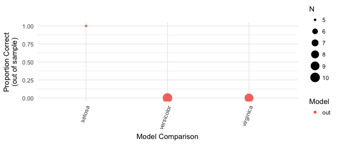

compatability check for kerasformula
================
Pete Mohanty
5/2/2019

This document attempts to fit a simple neural net using `kerasformula`. It also displays a number of version checks on `kerasformula` and its dependencies both in `R` and in `Python`. This document is intended to knit whether or not the model can be fit successfully. To run this code on your machine, [click here](https://github.com/rdrr1990/kerasformula/blob/master/short_course/kerasformula_diagnostic.Rmd).

``` r
if(!require(keras)) install.packages(keras)
```

    ## Loading required package: keras

``` r
if(!require(kerasformula)) install.packages(kerasformula)
```

    ## Loading required package: kerasformula

    ## Loading required package: dplyr

    ## 
    ## Attaching package: 'dplyr'

    ## The following objects are masked from 'package:stats':
    ## 
    ##     filter, lag

    ## The following objects are masked from 'package:base':
    ## 
    ##     intersect, setdiff, setequal, union

    ## Loading required package: Matrix

``` r
library(keras)
if(!is_keras_available()) install_keras()
keras_installed <- is_keras_available()
```

``` r
if(keras_installed){
  library(kerasformula)
  tried <- try(out <- kms(Species ~ ., iris, verbose=0))
  if(!inherits(tried, "try-error")) plot_confusion(out) else("Model failed to estimate.\n\n\n")
}else{
  message("keras did not install properly.\n")
}
```



``` r
system("which python > python_path.txt")
python_path <- readLines("python_path.txt")
python_path
```

    ## [1] "/Users/mohanty/.virtualenvs/r-tensorflow/bin/python"

If that path is correct, it should be set in two different ways. Making `changing_settings=TRUE` would accomplish that.

``` r
if(!require(reticulate)) install.packages(reticulate)
```

    ## Loading required package: reticulate

``` r
library(reticulate)

change_settings <- FALSE

if(change_settings){
  
  System.setenv(TENSORFLOW_PYTHON=python_path)
  use_python(python_path)
    
}
```

The Python path should appear for each of these key libraries...

``` r
py_discover_config("tensorflow")
```

    ## python:         /Users/mohanty/.virtualenvs/r-tensorflow/bin/python
    ## libpython:      /System/Library/Frameworks/Python.framework/Versions/2.7/lib/python2.7/config/libpython2.7.dylib
    ## pythonhome:     /System/Library/Frameworks/Python.framework/Versions/2.7:/System/Library/Frameworks/Python.framework/Versions/2.7
    ## virtualenv:     /Users/mohanty/.virtualenvs/r-tensorflow/bin/activate_this.py
    ## version:        2.7.10 (default, Feb  7 2017, 00:08:15)  [GCC 4.2.1 Compatible Apple LLVM 8.0.0 (clang-800.0.34)]
    ## numpy:          /Users/mohanty/.virtualenvs/r-tensorflow/lib/python2.7/site-packages/numpy
    ## numpy_version:  1.14.0
    ## tensorflow:     /Users/mohanty/.virtualenvs/r-tensorflow/lib/python2.7/site-packages/tensorflow
    ## 
    ## python versions found: 
    ##  /Users/mohanty/.virtualenvs/r-tensorflow/bin/python
    ##  /usr/bin/python
    ##  /usr/local/bin/python3
    ##  /Users/mohanty/env3/bin/python

``` r
py_discover_config("numpy")
```

    ## python:         /Users/mohanty/.virtualenvs/r-tensorflow/bin/python
    ## libpython:      /System/Library/Frameworks/Python.framework/Versions/2.7/lib/python2.7/config/libpython2.7.dylib
    ## pythonhome:     /System/Library/Frameworks/Python.framework/Versions/2.7:/System/Library/Frameworks/Python.framework/Versions/2.7
    ## virtualenv:     /Users/mohanty/.virtualenvs/r-tensorflow/bin/activate_this.py
    ## version:        2.7.10 (default, Feb  7 2017, 00:08:15)  [GCC 4.2.1 Compatible Apple LLVM 8.0.0 (clang-800.0.34)]
    ## numpy:          /Users/mohanty/.virtualenvs/r-tensorflow/lib/python2.7/site-packages/numpy
    ## numpy_version:  1.14.0
    ## numpy:          /Users/mohanty/.virtualenvs/r-tensorflow/lib/python2.7/site-packages/numpy
    ## 
    ## python versions found: 
    ##  /Users/mohanty/.virtualenvs/r-tensorflow/bin/python
    ##  /usr/bin/python
    ##  /usr/local/bin/python3
    ##  /Users/mohanty/env3/bin/python

``` r
py_discover_config("keras")
```

    ## python:         /Users/mohanty/.virtualenvs/r-tensorflow/bin/python
    ## libpython:      /System/Library/Frameworks/Python.framework/Versions/2.7/lib/python2.7/config/libpython2.7.dylib
    ## pythonhome:     /System/Library/Frameworks/Python.framework/Versions/2.7:/System/Library/Frameworks/Python.framework/Versions/2.7
    ## virtualenv:     /Users/mohanty/.virtualenvs/r-tensorflow/bin/activate_this.py
    ## version:        2.7.10 (default, Feb  7 2017, 00:08:15)  [GCC 4.2.1 Compatible Apple LLVM 8.0.0 (clang-800.0.34)]
    ## numpy:          /Users/mohanty/.virtualenvs/r-tensorflow/lib/python2.7/site-packages/numpy
    ## numpy_version:  1.14.0
    ## keras:          /Users/mohanty/.virtualenvs/r-tensorflow/lib/python2.7/site-packages/keras
    ## 
    ## python versions found: 
    ##  /Users/mohanty/.virtualenvs/r-tensorflow/bin/python
    ##  /usr/bin/python
    ##  /usr/local/bin/python3
    ##  /Users/mohanty/env3/bin/python

``` r
sessionInfo()
```

    ## R version 3.5.0 (2018-04-23)
    ## Platform: x86_64-apple-darwin15.6.0 (64-bit)
    ## Running under: macOS Sierra 10.12.6
    ## 
    ## Matrix products: default
    ## BLAS: /Library/Frameworks/R.framework/Versions/3.5/Resources/lib/libRblas.0.dylib
    ## LAPACK: /Library/Frameworks/R.framework/Versions/3.5/Resources/lib/libRlapack.dylib
    ## 
    ## locale:
    ## [1] en_US.UTF-8/en_US.UTF-8/en_US.UTF-8/C/en_US.UTF-8/en_US.UTF-8
    ## 
    ## attached base packages:
    ## [1] stats     graphics  grDevices utils     datasets  methods   base     
    ## 
    ## other attached packages:
    ## [1] reticulate_1.7     kerasformula_1.5.1 Matrix_1.2-14     
    ## [4] dplyr_0.7.5        keras_2.1.6       
    ## 
    ## loaded via a namespace (and not attached):
    ##  [1] Rcpp_0.12.19     plyr_1.8.4       compiler_3.5.0   pillar_1.3.0    
    ##  [5] bindr_0.1.1      base64enc_0.1-3  tools_3.5.0      zeallot_0.1.0   
    ##  [9] digest_0.6.15    jsonlite_1.5     evaluate_0.11    tibble_1.4.2    
    ## [13] gtable_0.2.0     lattice_0.20-35  pkgconfig_2.0.2  rlang_0.3.1     
    ## [17] yaml_2.2.0       bindrcpp_0.2.2   stringr_1.3.1    knitr_1.20      
    ## [21] rprojroot_1.3-2  grid_3.5.0       tidyselect_0.2.4 glue_1.3.0      
    ## [25] R6_2.3.0         rmarkdown_1.10   purrr_0.2.5      ggplot2_2.2.1   
    ## [29] magrittr_1.5     whisker_0.3-2    backports_1.1.2  scales_0.5.0    
    ## [33] tfruns_1.3       htmltools_0.3.6  assertthat_0.2.0 colorspace_1.3-2
    ## [37] labeling_0.3     tensorflow_1.5   stringi_1.2.4    lazyeval_0.2.1  
    ## [41] munsell_0.4.3    crayon_1.3.4
